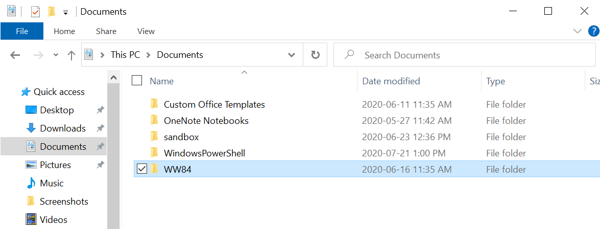
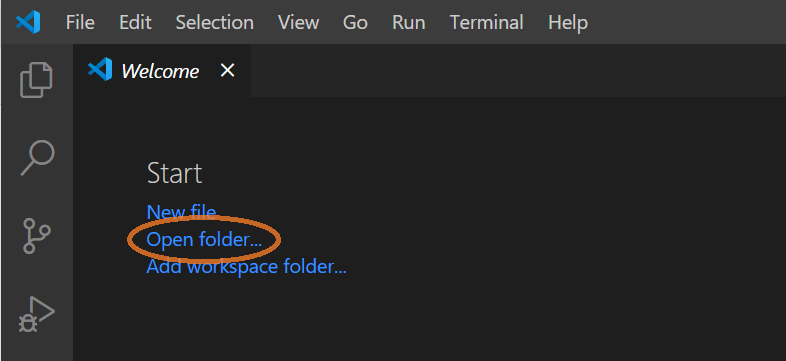
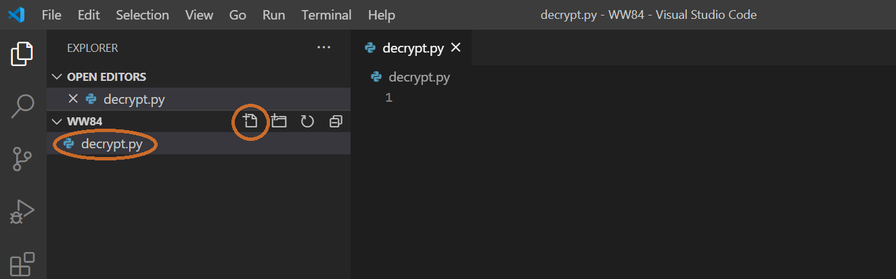
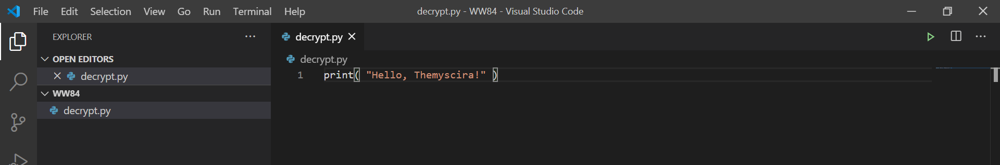

# Ensure Visual Studio Code is Ready to Decode Messages

Before you jump in to writing a program to decode messages, you should make sure your local environment is setup properly.

Let’s start by creating a folder on your computer where you can find easily it. Call it “WW84”—I created mine in my Documents folder.



Then open Visual Studio Code and select "Open folder..." from the start screen; open your WW84 folder.



Next create a file called "decrypt.py".



Also feel free to close the Welcome tab now.

**Note:** As you are coding in Python, Visual Studio Code will suggest other powers to add to Visual Studio Code, such as "Linters". You don't need these for this project, so feel free to ignore them.


The first thing we’ll do is make sure our command center (code editor) works. We’ll give a simple command that tells the Python to print us a message. Copy the following command into your file:

```python
print( "Hello, Themyscira!" )
```

Your editor should resemble this:



To have the Python follow your commands, press the green Play button in the upper right corner. You should see a message from the Python below.


Now you're ready to learn some of the Python basics needed to build your decoder.

WONDER WOMAN 1984 TM & © DC and WBEI. RATED PG-13