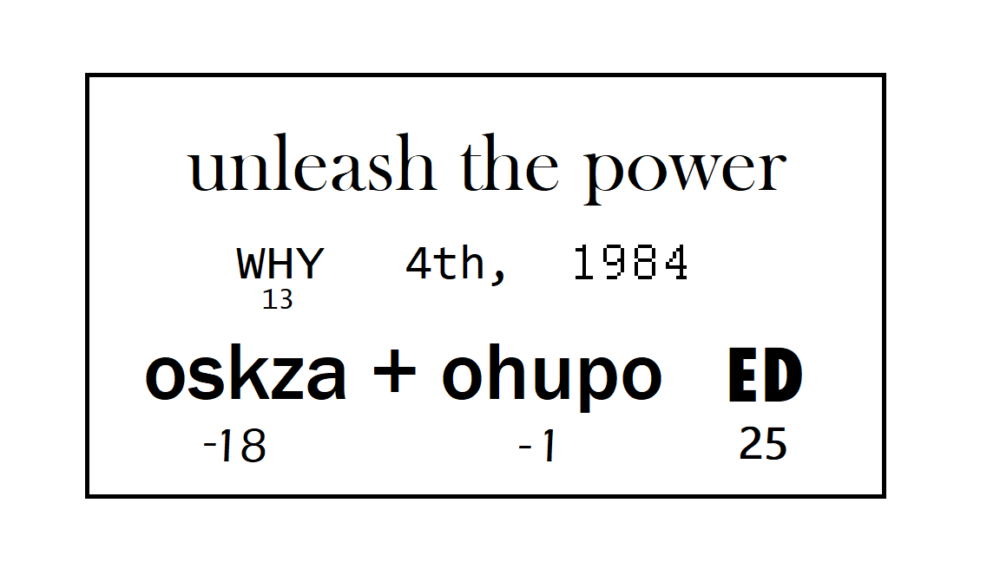

# Decoding One Letter at a Time Part 1

If you completed the [Wonder Woman Codehunt challenge](https://www.microsoft.com/inculture/wonderwoman-1984/#codehunt) or the [Wonder Woman and the Power of Tech Learn module](), then you already have an introduction to different ways of decoding messages. Take a look at this message:



With your new decoding knowledge, which decoder do you think would work best to decipher the true meaning of the words "WHY", “oskza”, “ohupo”, and "ED"?

## The Ceasar Cipher Function

It looks like the message might be encrypted with the [Caesar cipher](https://learninglab.si.edu/collections/decode-a-secret-message/y4f5099n4wjraemz#r/857650), where all the letters are shifted in the alphabet by some amount. Getting into the super hero universe mindset, I like to imagine that these on some big wall with wheels of letters and Wonder Woman is standing in front of it and has to use her lasso to whip the wheels around until the right letter is showing to then reveal the secret. 

Just me? 

In any case, to decipher this message you will start by giving your code the power to shift a single letter. To get started, create a function called `lassoLetter` that takes in two parameters. The first, `letter`, represents the letter that needs to be decoded. The second, `shiftAmount`, represents how much you need to shift the letter:

```python
def lassoLetter( letter, shiftAmount ):
```

Before you write your function, it's always a good idea to know what you're expecting to happen. So, if you invoked this function and passed in 'a' as the first parameter and 2 as the second parameter:

**Note:** don't actually do this yet in your code, since you haven't written the function yet.
```python
lassoLetter('a', 2)
```

You would expect the function to return the letter `c`. 

## Converting a Character to a Number

Next, you need to convert your letter into a number. If you recall from the Codehunt challenge, when you [converted Binary to letters and numbers](https://www.bing.com/search?q=binary+to+text+converter&qs=SC&pq=binary+to+text+coner&sc=8-20&cvid=4F01F15EE0D540698C86EF6B95AFD7C7&FORM=QBLH&sp=1) it was a binary number that represented an ASCII character (letter or number) and there was also a decimal number that represented it too:

| Character | ASCII | Binary |
|-----------|--------|-------|
| 0 | 48 | 00110000 |
| 1 | 49 | 00110001 |
| 2 | 50 | 00110010 |
| 3 | 51 | 00110011 |
| 4 | 52 | 00110100 |
| 5 | 53 | 00110101 |
| 6 | 54 | 00110110 |
| 7 | 55 | 00110111 |
| 8 | 56 | 00111000 |
| 9 | 57 | 00111001 |
| A | 65 | 01000001 |
| B | 66 | 01000010 |
| C | 67 | 01000011 |
| D | 68 | 01000100 |
| E | 69 | 01000101 |
| F | 70 | 01000110 |
| G | 71 | 01000111 |
| H | 72 | 01001000 |
| I | 73 | 01001001 |
| J | 74 | 01001010 |
| K | 75 | 01001011 |
| L | 76 | 01001100 |
| M | 77 | 01001101 |
| N | 78 | 01001110 |
| O | 79 | 01001111 |
| P | 80 | 01010000 |
| Q | 81 | 01010001 |
| R | 82 | 01010010 |
| S | 83 | 01010011 |
| T | 84 | 01010100 |
| U | 85 | 01010101 |
| V | 86 | 01010110 |
| W | 87 | 01010111 |
| X | 88 | 01011000 |
| Y | 89 | 01011001 |
| Z | 90 | 01011010 |
| a | 97 | 01100001 |	
| b | 98 | 01100010 |	
| c | 99 | 01100011 |	
| d | 100 | 01100100 |	
| e | 101 | 01100101 |	
| f | 102 | 01100110 |	
| g | 103 | 01100111 |	
| h | 104 | 01101000 |	
| i | 105 | 01101001 |	
| j | 106 | 01101010 |	
| k | 107 | 01101011 |	
| l | 108 | 01101100 |	
| m | 109 | 01101101 |	
| n | 110 | 01101110 |	
| o | 111 | 01101111 |	
| p | 112 | 01110000 |	
| q | 113 | 01110001 |	
| r | 114 | 01110010 |	
| s | 115 | 01110011 |	
| t | 116 | 01110100 |	
| u | 117 | 01110101 |	
| v | 118 | 01110110 |	
| w | 119 | 01110111 |	
| x | 120 | 01111000 |	
| y | 121 | 01111001 |	
| z | 122 | 01111010 |	

**NOTE**: This table only represents numbers and letters, but every single key on a keyboard has an ASCII number and a Binary representation of that number. 

So if you pass in the letter 'a' and a shiftAmount of 2 to the `lassoLetter` function, and you expect it to give you the letter `c`...how would you do that? 

Just doing `c`+2 doesn't make sense, because how to do you add a number and a letter together?

Python to the rescue!! Python has a function called `ord` that will convert a character to the ASCII number. So:
```python
ord('a')
```
would give you 97 and 
```python
ord('W')
```
would give you 87 and
```python
ord('6')
```
would give you 54. 

Adding 97+2 and getting 99 (which is `c` in ASCII) *does* make sense!

The next bit of code you will add to your function will be to do the following steps:
1. Convert the letter to convert into lowercase, so that we have consistency.
2. Convert the letter to its ASCII code using `ord()`. 

```python
def lassoLetter( letter, shiftAmount ):
    letterCode = ord(letter.lower())
```

**NOTE:** Make sure you have the code for the function tabbed in, otherwise it won't be read as part of the function!

So, if you were decoding the message above, then you'd want to shift 'W' by 13. If that were the case, you can quick review what values your varaiables would have:
- `letter`= 'W'
- `shiftAmount` = 13
- `letterCode` = `ord('w')` = 119

## Calculating the Decoded Character: The simple way

Now it's time to calculate the new character. First, review the original example. If you had 'a' and wanted to get 'c' then you would do the following:
1. Make sure 'a' was lower case
2. Convert 'a' to 97 using the `ord()` function and save 97 in a variable called `letterCode`
3. Add a `shiftAmount` of 2 to the `letterCode` amount of 97 and get 99 and store 99 in a variable called `decodedLetterCode`
4. Convert 99 back to a character using the `chr()` function (which just does the opposite of the `ord()` function) and store 'c' in a variable called `decodedLetter`
5. Return the `decodedLetter` value of `c`

So you might do something like this:
```python
letterCode = ord(letter.lower())

decodedLetterCode = letterCode + shiftAmount

decodedLetter = chr(decodedLetterCode)

return decodedLetter
```

So let's see what would happen if you did that with the first letter of the actual secret message, 'W', and the actual shiftAmount, 13:

| Variable | Value | 
|----------|-------|
| letter | 'W' |
| shiftAmount | 13 |
| letterCode | `ord('w')` = 119 |
| decodedLetterCode | 119 + 13 = 132 |
| decodedLetter | chr(132) = `error` |

That wouldn't work...because a Ceasar cipher will loop around back to 'a' when it's reached 'z'...

So, to take into account that loop, you will have to change your formula for getting the `decodedLetterCode` value. Instead of just adding the `shiftAmount` to the `letterCode` you have to figure out what the **true** letter code would be for the decoded letter. 

WONDER WOMAN 1984 TM & © DC and WBEI. RATED PG-13